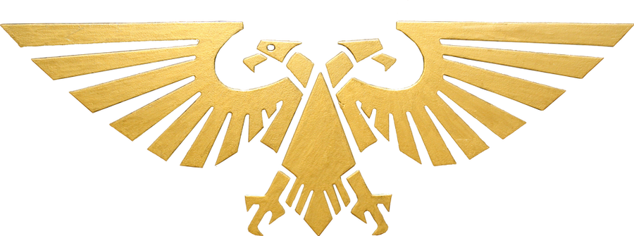

[](http://www.wtfpl.net/)
[](https://pypi.org/project/pydate40k/)
[](https://pypi.org/project/pydate40k/)
[](https://github.com/pgaetani/pydate40k/actions/workflows/ci.yml)

# Imperial Dating System converter

> **Unofficial fan-made utility.** Not affiliated with, endorsed, sponsored, or approved by Games Workshop Limited. Free, non-commercial, and made purely for entertainment. Full disclaimer at the bottom of this page.

Based on the information from the [Wiki](https://warhammer40k.fandom.com/wiki/Imperial_Dating_System).

## Usage

Creating an instance of the object with no parameters will convert the current date (at the moment).
```python
from pydate40k import Date40k

d = Date40k()
print(d)
>>> 944 019.M3
```

Passing a `datetime` object will convert that date instead.
```python
from datetime import datetime
from pydate40k import Date40k

d = Date40k(datetime(1999, 5, 11, 13, 0, 0))
print(d)
>>> 360 999.M2
```

`date` must be a `datetime` instance or `None` -- anything else (including a
date string) raises `TypeError` rather than silently falling back to today.
Any year from 1 to 9999 is supported.

### Known behavior

The `year_fraction` portion of the output is zero-padded to a *minimum* of
3 digits, not clamped to a maximum -- it renders as 4 digits on any date at
23:xx local time on December 31st. This is expected, not a bug.

## Development

```
git clone git@github.com:pgaetani/pydate40k.git
cd pydate40k
uv sync
uv run pytest
uv run ruff check .
uv run mypy
```

Supports Python 3.8-3.14.

## Disclaimer

*`pydate40k` is unofficial fan-made software. It is not affiliated with, endorsed by, sponsored by, or in any way officially connected with Games Workshop Limited, and does not constitute formal approval of any kind. This project is entirely non-commercial: it is free to use, contains no advertising, and generates no revenue of any kind, directly or indirectly, for anyone. No text or artwork from official Games Workshop products is copied, embedded, or distributed by this project or its source repository. The footer image below is a fan-made illustration by a third-party artist, reproduced here with credit under its stated license (see the caption beneath it) — it depicts the Aquila, which remains Games Workshop's trademark regardless of who drew this particular rendition.*

*See Games Workshop's own [Intellectual Property Guidelines](https://www.warhammer.com/shop/Intellectual-Property-Guidelines) for their current policy on fan-made content.*

*GW, Games Workshop, Citadel, Black Library, Forge World, Warhammer, the Twin-tailed Comet logo, Warhammer 40,000, the ‘Aquila’ Double-headed Eagle logo, Space Marine, 40K, 40,000, Warhammer Age of Sigmar, Battletome, Stormcast Eternals, White Dwarf, Blood Bowl, Necromunda, Space Hulk, Battlefleet Gothic, Dreadfleet, Mordheim, Inquisitor, Warmaster, Epic, Gorkamorka, and all associated logos, illustrations, images, names, creatures, races, vehicles, locations, weapons, characters, and the distinctive likenesses thereof, are either ® or TM, and/or © Games Workshop Limited, variably registered around the world. All Rights Reserved.*

---

<p align="center">
  
</p>
<p align="center">
  <sub>Artwork: <a href="https://www.deviantart.com/fuguestock/art/40k-Imperial-Aquila-transparent-546559149">"40k Imperial Aquila (transparent)"</a> by <a href="https://www.deviantart.com/fuguestock">fuguestock</a>, licensed <a href="https://creativecommons.org/licenses/by-nc/3.0/">CC BY-NC 3.0</a>.</sub>
</p>
